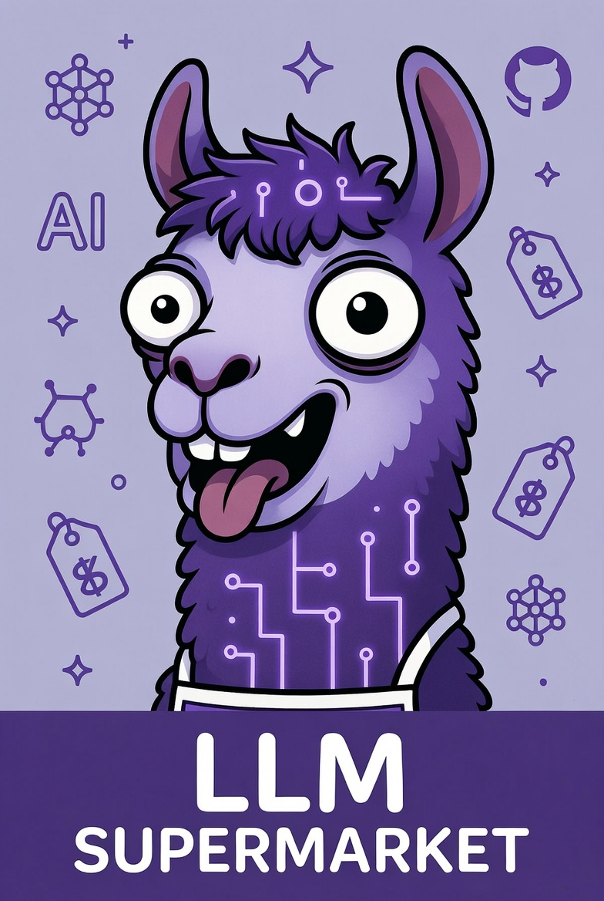

# llm-supermarket

This is a set of basic coding tests used to compare LLM coding models and find out if:

1. A model can complete the task.
2. How the model costs to complete the task.

The task are not overly complicated and already have examples on GitHub that models can borrow from (this is removed in the 'hard' mode tests). 
The task is intended to be something models can complete, but at the same time isn't a basic kata. The intention is to see how far a model can autonomously 
complete the task, and how much it costs.

If models and the tooling gradually improve the price should drop, number of tokens used should drop, and completeness should improve.

## Coding tests

### 1. CLI
This is a basic task to create a CLI tool (default is using GoLang) that encrypts and decrypts files, which adheres to the rclone encrypt format. 
It has a Go-bias to it, as the rclone tool is written in Go.

Instructions:
1. Create a new Github repository called "rclone-encrypt" or similar.
1. Add a README. Paste in the contents of `README_EASY.md` or `README_HARD.md` into the repository's readme and push.
1. Commit the test file "files/kr9tu4e1da4u3nifdd99g9tf5o" to the repository root and push.
1. Commit the test file "files/Iyxcijgc9bp3o5Y0npW6xqUvwWNcc3MA4SadB0sR6cY" to the repository root and push.
1. Clone the repository.
1. Pick a model and paste in `PROMPT_EASY.txt` or `PROMPT_HARD.txt` and let it run.

The task should be under $5 unless something went badly wrong.

## Results

All models used medium effort.  
"% used" shows the context it used, typically a percentage of 256k.

## CLI task

Tests results are from June 2026. The code repositories can be found in [The Github "llm-supermarket" organisation](https://github.com/orgs/llm-supermarket/repositories/)

| **Model**              | Language | Tokens               | Pass/Fail  | Cost  | Time taken              | Notes                                                                                                                                       |
|------------------------|----------|----------------------|------------|-------|-------------------------|---------------------------------------------------------------------------------------------------------------------------------------------|
| **Claude 4.5 Haiku**   | go       | 71.9k                | ❌         | $1.33 | 8 minutes 46 seconds   | Didn't finish: failed to decrypt files with "authentication tag verification failed". No auto mode; lots of "Do you want to proceed?".      |
| **Claude 4.6**         | go       | 146.4k               | ❌         | $5.75 | 40 minutes 41 seconds  | Failed to decrypt files; asked about rclone custom salt. Passed after nudge to look at example repo. *(Need to re-run using Github.com)*    |
| **Claude 4.8**         | go       | 87.8k                | ✅         | $6.84 | 15 minutes 42 seconds  | Successfully decrypted both files. Needs public GitHub for Scoop. Offered to merge PR. Wrote clear TODO list. *(Need to re-run Github.com)* |
| **DeepSeek V4 Flash**  | go       | 99,914 (10% used)    | ✅         | $0.17 | 55 minutes 21 seconds  | Confused PR merging with Scoop installation and became stuck. *(Need to re-run)*                                                            |
| **DeepSeek V4 Flash**  | csharp   | 235,746 (24% used)   | ✅         | $0.86 | ~45 minutes            |                                                                                                                                             |
| **DeepSeek V4 Flash**  | python   | 102,594 (10% used)   | ✅         | $0.05 | ~19 minutes            | Had to ask it to verify it had installed via pip before completing.                                                                         |
| **Gemini 3.5 Flash**   | go       | 324,349 (31% used)   | ✅         | $6.82 | 40 minutes 25 seconds  |                                                                                                                                             |
| **GLM-5.2**            | go       | 178,847 (18% used)   | ✅         | $4.71 | ~40 minutes 31 seconds | Worked out how to merge automatically and that the app name was incorrect.                                                                  |
| **GPT-5.1 Codex Mini** | go       | 76,671 (19% used)    | ✅         | $0.52 | Not provided           | Didn't merge changes; I merged and had to re-prompt. Prompt was missing this.                                                               |
| **GPT-5.1 Codex Mini** | csharp   | 154,561 (39% used)   | ❌         | $4.10 | ~1 hour                | Didn't finish: stopped before completion. Didn't create a `.gitignore`.                                                                     |
| **GPT-5.3 Codex**      | csharp   | 153,000 (39%)        | ❌         | $3.57 | ~50 minutes            | Didn't finish: had to prompt 3 times, then succeeded with Scoop.                                                                            |
| **Grok Build 0.1**     | go       | 74,238 (29% used)    | ✅         | $1.16 | ~15 minutes            |                                                                                                                                             |
| **Grok Build 0.1**     | csharp   | 196,769 (77% used)   | ✅         | $5.14 | 47 minutes 40 seconds  |                                                                                                                                             |
| **Grok Build 0.1**     | python   | 142,577 (56% used)   | ✅         | $1.94 | ~20 minutes            |                                                                                                                                             |
| **Kimi 2.7 code**      | go       | 132,799 (51% usage)  | ✅         | $2.18 | ~42 minutes            | Prompted for PR to be merged. Ran two code reviews without prompting.                                                                       |
| **Kimi 2.7 code**      | csharp   | 27,871 (11% usage)   | ✅         | $3.90 | ~1 hour                | Prompted for PR to be merged. Darwin build failed on GitHub; fixed upon prompting. Asked to create a tag.                                   |
| **Kimi 2.7 code**      | python   | 73,671 (28% usage)   | ✅         | $0.91 | ~40 minutes            | Didn't need a PR but created one per instructions. Went slowly for a while.                                                                 |
| **MiniMax M2.7**       | go       | 118,479 (58% usage)  | ❌         | $0.99 | 28 minutes             | Failed - didn't infer the default rclone salt (I changed the prompt after this). It did prompt with 3 options for me to merge the PR        |
| **Qwen 3.6 plus**      | go       | 123,123 (50% usage)  | ✅         | $0.51 | 30 minutes             | It auto merged the PR, didn't prompt for it to be merged.                                                                                   |
| **Qwen 3.6 plus**      | csharp   | 225,871 (23% usage)  | ✅         | $3.78 | 55 minutes             | It auto merged the PR, didn't prompt for it to be merged.                                                                                   |
